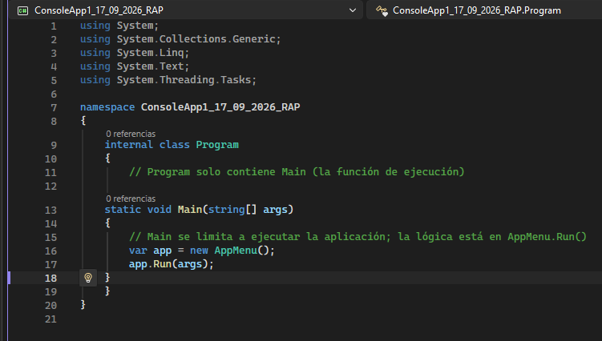

# ConsoleApp1_17_09_2026_RAP
1. Program.cs
Punto de entrada de la aplicación.

Llama a los métodos principales y coordina la ejecución.

Aquí se inicializan repositorios, autenticadores y menús.
--Imagen--1

2. AppMenu.cs
Maneja la lógica del menú en consola.

Presenta opciones al usuario (registrar, autenticar, consultar).

Redirige las elecciones hacia las clases correspondientes.

3. Autenticador.cs
Implementa la lógica de autenticación.

Usa principios SOLID y patrones de diseño.

Valida credenciales contra el repositorio de usuarios.

Maneja excepciones con try/catch y throw.

4. Usuario.cs / UsuarioBase.cs
Representan la entidad usuario.

Contienen propiedades como nombre, contraseña, rol.

UsuarioBase puede ser clase abstracta o padre para extender funcionalidades.

5. Rol.cs
Define roles de usuario (ej. Admin, Invitado).

Permite aplicar reglas de autorización según el rol.

6. UserRegistrar.cs
Encargado de registrar nuevos usuarios.

Aplica validaciones y guarda en el repositorio.

7. SeedUsuarios.cs
Crea usuarios iniciales (semilla) para pruebas.

Útil para no empezar con repositorio vacío.

8. UserQueryExamples.cs
Contiene ejemplos de consultas sobre usuarios.

Sirve como demostración de cómo interactuar con el sistema.

9. PasswordHasher.cs
Se encarga de encriptar/hashear contraseñas.

Asegura que no se guarden en texto plano.

10. InMemoryUserRepository.cs
Implementación de repositorio en memoria.

Guarda usuarios en listas internas.

Ideal para pruebas sin base de datos.

11. IUserRepository.cs / IReadOnlyUserRepository.cs
Interfaces que definen contratos para repositorios.

Separan lectura y escritura (principio de responsabilidad única).

12. IAutenticacion.cs
Interface para definir el contrato de autenticación.

Permite intercambiar distintas implementaciones.

13. INotification.cs / ConsoleNotifier.cs
Manejan notificaciones al usuario.

ConsoleNotifier muestra mensajes en la consola.

14. ConsoleUtils.cs
Utilidades para manejo de consola (ej. limpiar pantalla, formatear texto).

15. Config.cs / App.config
Archivos de configuración.

Guardan parámetros como conexión, opciones de ejecución.

🔄 Flujo de funcionamiento
Inicio → Program.cs arranca la aplicación.

Menú → AppMenu.cs muestra opciones al usuario.

Registro → UserRegistrar.cs crea usuarios y los guarda en InMemoryUserRepository.

Autenticación → Autenticador.cs valida credenciales usando PasswordHasher.

Roles → Rol.cs determina permisos.

Notificación → ConsoleNotifier.cs informa resultados en consola.

Consultas → UserQueryExamples.cs permite probar búsquedas de usuarios
--Diagrama de Flujo--

--Ejecucion de Program--

--Ejecucion de Autenticacion--

